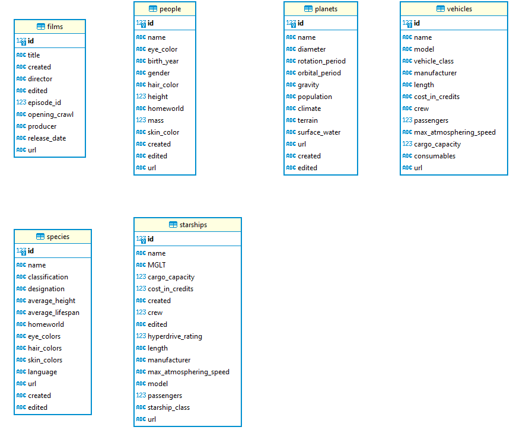

# Desafio Star-Wars | Back-End
 Script criado em python utilizando SQLAlchemy e SQLite para consumir os dados da API do Star Wars e colocar em um banco de dados.

Para rodar o código no Windows precisa executar no terminal:
venv\Scripts\Activate.ps1

Caso não esteja, ou, após ativar, colocar no terminal:
python -m venv venv

Para rodar o código:
python main.py

